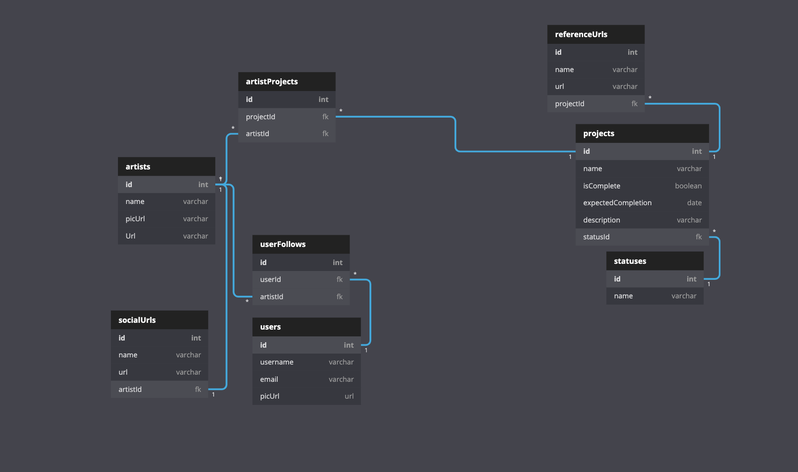

A front-end capstone project from [Landon Morgan](https://github.com/Iandonmorgan) for [Nashville Software School C38](https://github.com/nss-day-cohort-38).

## Brief Proposal

Clients need video projects and provide certain details. A user logs into Commissioner Mordan, a helpful app designed to track information related to the commissioning of video projects. A user can create, read, update and delete video projects.

## Project Definition

* Written in React.
* Users can create account, login via Session Storage, and logout
* Ability to create, read, update, delete “Artists”
* Ability to create, read, update, delete “Projects”

## Setup

Steps to get started:
1. `git clone git@github.com:Iandonmorgan/front-end-capstone.git`
1. `cd` into the directory it creates
1. `mkdir api`
1. `touch api/`
1. Download file: [database.json](https://drive.google.com/open?id=1RC4Nys7nZWJbD-viWxyAq8fhKiIRShoC) and put it into your api folder.
1. [Install yarn for dependencies](https://classic.yarnpkg.com/en/docs/install/#mac-stable)
1. `yarn install` to build dependencies
1. `yarn start` to run the app in the development mode
1. `json-server -p 7770 -w api/database.json`
1. Open [http://localhost:3000](http://localhost:3000) to view it in the browser.

## Overview

This app is a project management tool for video content creation. When a user logs in, they see a dashboard of current “projects” by artist, with basic information and statuses. The user can expand details of a specific “project” by clicking on it. From there, the user can edit and delete the “project”. The information tracked for each project includes project scope, budget, artist associated, contacts, live date, due+delivery date, status, shoot date(s) past and pending.

(*) **Note: this is not true authentication.** Email addresses are saved in clear text in the JSON database, and anyone who knows your email could login to see information inside database. Do not store any sensitive information, including, but not limited to birthdates, social security numbers, mother's maiden names, names of first pets, and/or shoe sizes.

## Technologies Used

This project utilizes the following:
* This project was bootstrapped with [Create React App](https://github.com/facebook/create-react-app).
* [Semantic UI](https://react.semantic-ui.com/) for buttons, icons, data-tooltips
* [React Confirm Alert](https://www.npmjs.com/package/react-confirm-alert) for confirm alerts
* [React Router](https://reacttraining.com/react-router/) for page routing
* [React-bootstrap](https://react-bootstrap.github.io/) for menu, flexible formatting
* [React-PopUp](https://www.npmjs.com/package/reactjs-popup) for form pop-ups
* [react-currency-input](https://github.com/larkintuckerllc/react-currency-input) for currency input

## Skills Utilized

We utilized all skills and concepts learned up to this point in our time here at NSS, including:

1. React: hooks, state, props, routes
1. API calls with: POST, PUT, PATCH, DELETE, and GET (with expand, embed)
1. Javascript: functions, objects, arrays, mapping
1. Persistent data storage with JSON Server
1. Github Scrum workflow
1. CSS styling
1. Modular code
1. Semantic HTML
1. [Valid HTML5](https://validator.w3.org/)

## Database Diagram
