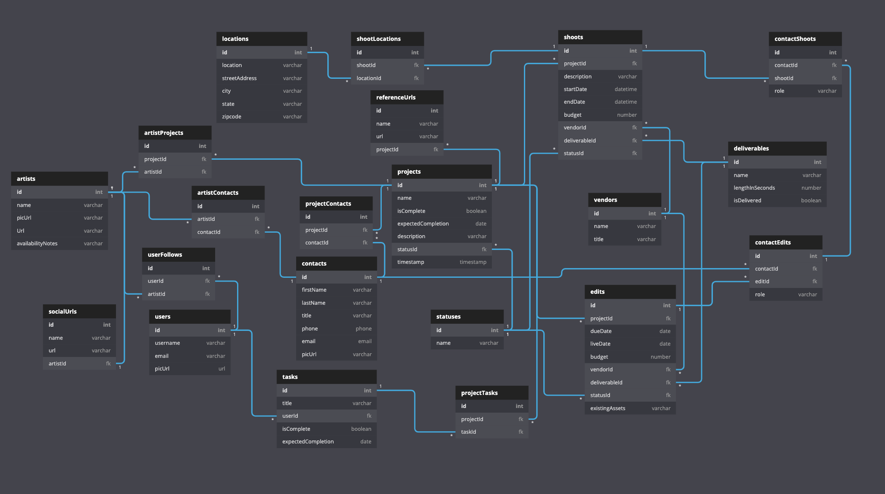

# Commissioner Mordan

A front-end capstone project from [Landon Morgan](https://github.com/Iandonmorgan) for [Nashville Software School C38](https://github.com/nss-day-cohort-38).

## Brief Proposal

Clients need video projects and provide certain details. A user logs into Commissioner Mordan, a helpful app designed to track information related to the commissioning of video projects. A user can create, read, update and delete video projects.

## MVP Definition

* Written in React.
* Users can create account, login via Session Storage, and logout
* Ability to create, read, update, delete “Artists”
* Ability to create, read, update, delete “Projects”

## Dream Stretch Goals
* Ability to create, read, update, delete “Contacts”
* Ability to create, read, update, delete “Shoots”
* Ability to create, read, update, delete “Edits”
* Ability to create, read, update, delete “Tasks”
* Styling with Bootstrap
* 1-2 easter egg features

## Setup

Steps to get started:
1. `git clone git@github.com:Iandonmorgan/front-end-capstone.git`
1. `cd` into the directory it creates
1. `mkdir api`
1. `touch api/database.json` or replace with test database file (contact Landon)
1. `npm install` to build dependencies
1. `npm start` to run the app in the development mode
1. `json-server -p 7770 -w api/database.json`
1. Open [http://localhost:3000](http://localhost:3000) to view it in the browser.

## Overview

This app is a project management tool for video content creation. When a user logs in, they see a dashboard of current “projects” by artist, with basic information and statuses. The user can expand details of a specific “project” by clicking on it. From there, the user can edit and delete the “project”. The information tracked for each project includes project scope, budget, artist associated, contacts, live date, due+delivery date, status, shoot date(s) past and pending.

(*) **Note: this is not true authentication.** Passwords are saved in clear text on the JSON database. Do not use any sensitive information. 

## Technologies Used

This project utilizes the following:
* This project was bootstrapped with [Create React App](https://github.com/facebook/create-react-app).
* [Semantic UI](https://semantic-ui.com/) for buttons, icons, data-tooltips
* [React Burger Menu](https://github.com/negomi/react-burger-menu) for the 'burger' nav menu
* [React Confirm Alert](https://www.npmjs.com/package/react-confirm-alert) for confirm alerts
* [React Router](https://reacttraining.com/react-router/) for page routing
* [React-bootstrap](https://react-bootstrap.github.io/) because why not
* [Cloudinary](https://cloudinary.com/documentation/react_image_and_video_upload)

## Skills Utilized

We utilized all skills and concepts learned up to this point in our time here at NSS, including:

1. React: hooks, state, props, routes
1. API calls with: POST, PUT, PATCH, DELETE, and GET (with expand, embed)
1. Javascript: functions, objects, arrays, mapping
1. Persistent data storage with JSON Server
1. Github Scrum workflow
1. CSS styling
1. Modular code
1. Semantic HTML
1. [Valid HTML5](https://validator.w3.org/)

## Database Diagram (including stretch goals)

## Available Scripts

In the project directory, you can run:

### `npm start`

Runs the app in the development mode. 
Open [http://localhost:3000](http://localhost:3000) to view it in the browser.

The page will reload if you make edits. 
You will also see any lint errors in the console.

### `npm test`

Launches the test runner in the interactive watch mode. 
See the section about [running tests](https://facebook.github.io/create-react-app/docs/running-tests) for more information.

### `npm run build`

Builds the app for production to the `build` folder. 
It correctly bundles React in production mode and optimizes the build for the best performance.

The build is minified and the filenames include the hashes. 
Your app is ready to be deployed!

See the section about [deployment](https://facebook.github.io/create-react-app/docs/deployment) for more information.

### `npm run eject`

**Note: this is a one-way operation. Once you `eject`, you can’t go back!**

If you aren’t satisfied with the build tool and configuration choices, you can `eject` at any time. This command will remove the single build dependency from your project.

Instead, it will copy all the configuration files and the transitive dependencies (webpack, Babel, ESLint, etc) right into your project so you have full control over them. All of the commands except `eject` will still work, but they will point to the copied scripts so you can tweak them. At this point you’re on your own.

You don’t have to ever use `eject`. The curated feature set is suitable for small and middle deployments, and you shouldn’t feel obligated to use this feature. However we understand that this tool wouldn’t be useful if you couldn’t customize it when you are ready for it.

## Learn More

You can learn more in the [Create React App documentation](https://facebook.github.io/create-react-app/docs/getting-started).

To learn React, check out the [React documentation](https://reactjs.org/).

### Code Splitting

This section has moved here: https://facebook.github.io/create-react-app/docs/code-splitting

### Analyzing the Bundle Size

This section has moved here: https://facebook.github.io/create-react-app/docs/analyzing-the-bundle-size

### Making a Progressive Web App

This section has moved here: https://facebook.github.io/create-react-app/docs/making-a-progressive-web-app

### Advanced Configuration

This section has moved here: https://facebook.github.io/create-react-app/docs/advanced-configuration

### Deployment

This section has moved here: https://facebook.github.io/create-react-app/docs/deployment

### `npm run build` fails to minify

This section has moved here: https://facebook.github.io/create-react-app/docs/troubleshooting#npm-run-build-fails-to-minify
